# CI Intel Tool

A working competitive-intelligence system for JFrog: daily RSS ingestion, Gemini classification, transparent relevance scoring, and a sourced comparison matrix against core competitors.
Built as a Stage 1 take-home for the GenAI & Competitive Intelligence Engineer role - real pipeline and UI, not a mockup.
Config-driven, cost-aware, and demoable with local SQLite or an optional shared Turso database.

Developed with AI-assisted tooling (Cursor), design decisions are documented in [DECISIONS.md](DECISIONS.md).

**Live demo (no setup needed): LIVE_DEMO_URL**

## Live review demo

- **Intentionally open for the review.** No login and the full behavior of the dashboard (feedback, weights, Ask the Digest, the two pipeline buttons). It runs on temporary free-tier accounts (Streamlit Community Cloud, Turso, Gemini, a GitHub token) that will be deleted after the review. A production deployment would not be open, see [DECISIONS.md](DECISIONS.md#2026-10-08-temporary-open-review-demo).
- **Pages can be slow.** The app server and the free database are in different regions, so every page load pays a few cross-region round trips.
- **How the two buttons work.** **Run daily ingest** and **Retry scoring** do not run anything inside the dashboard. Each one asks GitHub to start the existing workflow (`daily_ingest.yml` or `retry_pending.yml`) on `main` through the GitHub REST API (`workflow_dispatch`). After a click you get a link to the new run on [GitHub Actions](https://github.com/morandeporto/ci-intel-tool/actions). A run takes 2-3 minutes, then refresh the page and check the **Pipeline runs** tab. Both buttons lock for 3 minutes per browser session, and the two workflows share one concurrency group, so runs never overlap. If no new news has appeared since the last run, the run reports 0 new items: that is deduplication working.

## Quick look

1. **See it without installing** - screenshots later in this README (UI tour).
2. **Run it with no keys** - the app starts, Comparison loads from config, Daily Digest shows an empty state until news is collected.
3. **See real data in a few minutes** - get a free [Gemini API key](https://aistudio.google.com/apikey) from Google AI Studio, copy `.env.example` to `.env` and set `GEMINI_API_KEY` (leave the Turso variables empty to use local SQLite), then:

   ```bash
   python -m src.pipeline.run_daily --backfill-days 2
   streamlit run src/ui/app.py
   ```

   Open [http://localhost:8501](http://localhost:8501). Ask the Digest also uses the Gemini key, the free tier has a small daily quota.

4. **Shared live data** - the [live review demo](#live-review-demo) reads the shared Turso database, its credentials are not public.

Happy to walk you through it or run a live demo, contact me through the application.

---

## Quick start

### Prerequisites

- Python **3.11+** (GitHub Actions uses 3.11)
- A [Gemini API key](https://aistudio.google.com/apikey) for live classification and Ask the Digest (not required for `--dry-run` or unit tests)
- Optional: [Turso](https://turso.tech/) database URL + auth token for a shared demo DB

### Setup

```bash
git clone https://github.com/morandeporto/ci-intel-tool.git
cd ci-intel-tool
python3 -m venv .venv
source .venv/bin/activate          # Windows: .venv\Scripts\activate
pip install -r requirements.txt
cp .env.example .env
```

Edit `.env` and set at least:

```
GEMINI_API_KEY=your-gemini-api-key-here
```

Leave `TURSO_DATABASE_URL` / `TURSO_AUTH_TOKEN` as placeholders (or blank) to use **local SQLite** at `data/ci_intel.db`. When both Turso vars are set to real values, the app and pipeline use the shared Turso database instead. Never commit `.env` (it is gitignored). See [`.env.example`](.env.example) for the full template.

### Run the UI

```bash
streamlit run src/ui/app.py
```

An empty database shows: *No items yet. News is collected automatically by the daily workflow, see the Pipeline runs tab.* (there is no committed seed/fake DB). The dashboard does not run ingestion itself. Its two pipeline buttons only dispatch the GitHub workflows and stay disabled until `GITHUB_DISPATCH_TOKEN` is set.

### Trigger collection manually

Ingestion runs in the background only (scheduled workflows, manual dispatch, or CLI) - never inside the Streamlit process.

**GitHub Actions**

1. Open the repo on GitHub → **Actions**
2. Select **Daily CI Intel Ingest** (`daily_ingest.yml`)
3. Click **Run workflow** (uses repository secrets for Gemini + Turso)

The dashboard's **Run daily ingest** / **Retry scoring** buttons send the same `workflow_dispatch` through the GitHub REST API (fine-grained token, this repository only, **Actions: Read and write**).

**Locally (CLI)**

```bash
# Fetch + freshness + gate + select + print - no LLM calls, no DB writes
python -m src.pipeline.run_daily --dry-run

# Live ingest + classify (requires GEMINI_API_KEY)
python -m src.pipeline.run_daily
```

### Run tests

```bash
pytest -q
```

### How to access the UI

After `streamlit run src/ui/app.py`, open [http://localhost:8501](http://localhost:8501) (Streamlit’s default).

---

## How this answers the brief

| Brief requirement | Where this repo covers it |
|-------------------|---------------------------|
| Daily updates on industry / competitor news | Pipeline + GitHub Actions cron (`daily_ingest.yml` at 04:17 UTC), Daily Digest tab |
| JFrog vs competitors comparison | Comparison tab + curated `config/comparison.yaml` (every claim sourced or Unknown) |
| Real working solution (not a mockup) | Live RSS → classify → SQLite/Turso → Streamlit, GitHub Actions cron + manual/CLI ingest |
| Design / architecture / mechanism | [Architecture](#architecture), [Key design decisions](#key-design-decisions), [DECISIONS.md](DECISIONS.md) |
| A real UI | Streamlit app (`src/ui/app.py`) with four sections - see [UI tour](#ui-tour) |
| Built-now vs future split | [Built now vs future work](#built-now-vs-future-work) |
| Challenges and pitfalls | [Challenges and pitfalls](#challenges-and-pitfalls) |

---

## Architecture

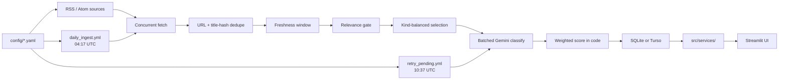

**Config → sources.** Tracked vendors and feed URLs live in `config/competitors.yaml` and `config/sources.yaml` (enabled flags, kind, gate mode, `required`). No mock URLs - feeds are verified or disabled with dated notes.

**Fetch.** Concurrent HTTP fetch (`fetch_concurrency`, `fetch_timeout_seconds` in `config/model.yaml`). Default identifiable User-Agent, only `jfrog_blog` uses a browser UA when the honest UA gets empty HTTP 202 responses.

**Dedupe.** Skip items already stored by **URL** or by **normalized title hash** (`src/process/dedupe.py`). Same story under two different titles can still appear twice.

**Freshness window.** Keep items with `published_at` inside `window_hours` (default **48**). Future-dated items are dropped, missing dates are logged. `--backfill-days N` widens the window for a real backfill.

**Relevance gate.** Per-source `gate: off` (official/emerging) or `gate: strict` (industry/community) using `config/relevance.yaml` strong keywords. Maintenance title patterns are excluded for all sources.

**Selection.** Cap via `max_items_per_run` (20) and `max_per_source` (3), with reserved slots by kind (`selection.reserved_slots` in `config/model.yaml`). Cap-skipped items are not stored.

**Batched classification.** Gemini structured JSON in batches of `batch_size` (5). Soft per-model budgets in `model_daily_limits`, hard stop is Google’s free-tier PerDay error. On a daily quota the run walks the ordered `fallback_models` chain (`gemini-3.5-flash-lite`, then `gemini-2.5-flash-lite`), skipping hard-blocked models and using each model at most once per run. Every switch is written to the run's `error_message`. When the chain is exhausted the remaining selected items stay `pending_scoring`. `ask_model` is never part of the chain, so pipeline runs cannot spend the Ask quota.

**Weighted score in code.** LLM returns dimension scores 1-5, `src/process/scoring.py` applies weights from `config/weights.yaml` (or DB overrides). Retuning weights needs no new LLM calls.

**Database.** Local `data/ci_intel.db` or Turso when configured. Schema in `data/schema.sql`, migrations in `src/db/migrate.py`.

**Services → UI.** `src/services/` (digest, ask, comparison, feedback, weights) stays separate from Streamlit so a future read-only MCP layer can wrap the same functions.

**GitHub Actions.** `daily_ingest.yml` (04:17 UTC + manual) runs ingest against Turso. `retry_pending.yml` (10:37 UTC) runs `--rescore-fallbacks`. Both share concurrency group `ci-intel-pipeline`. Scheduled times are best-effort on GitHub (see [Challenges and pitfalls](#challenges-and-pitfalls)). The dashboard buttons start the same workflows via `workflow_dispatch` (`src/services/github_dispatch.py`, settings in `config/demo.yaml`).

**Secrets.** `src/app_secrets.get_secret` reads environment variables first (`.env`, GitHub Actions) and falls back to `st.secrets` on Streamlit Community Cloud. Values are never logged or rendered.

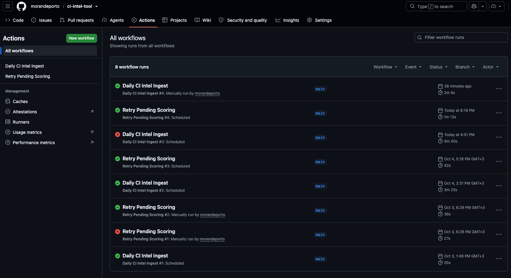
*GitHub Actions history for both workflows, with scheduled and manual runs.*

---

## UI tour

The Streamlit app emulates a JFrog-like dark aesthetic (navy `#070B19`, green `#40BE46`, Open Sans via theme/CSS). It is **not** an official JFrog component library. Streamlit is pinned at `streamlit==1.39.0` because custom tab/button CSS is fragile across releases.

Navigation uses a horizontal radio (not `st.tabs`) so Ask follow-ups and weight/feedback saves stay on the active section after rerun.

### Daily Digest

Sorted news cards with filters, weight sliders, and 👍/👎 feedback. Ingestion is **not** started from this tab - use GitHub Actions or the CLI (see [Trigger collection manually](#trigger-collection-manually)).
The **News date** filter uses the calendar day the system **ingested** the item (`ingested_at` → Asia/Jerusalem), cards still show the article’s **published** date (Israel local). Default is Israel “today”, or the latest day that has items.
**Minimum relevance** (default 2.5) hides lower scored items, **Show unscored** reveals `pending_scoring` / fallback rows (shown as “Not scored”). Weight sliders must sum to 1.00, **Save weights** re-ranks the list from stored dimensions without new LLM calls and persists the shared weights to the DB.

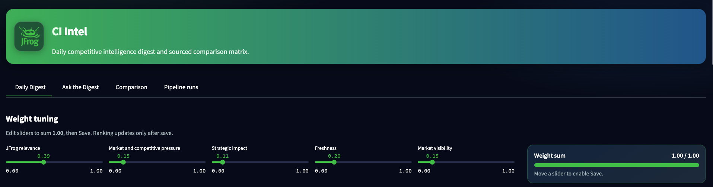
*Weight tuning panel: five dimension sliders and the weight-sum check that enables Save.*

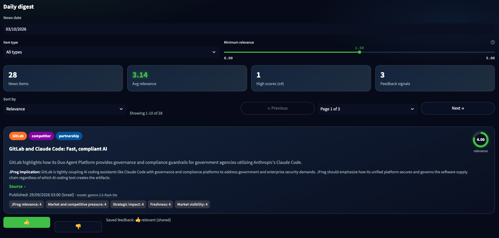
*Filters (news date, item type, minimum relevance) and the KPI cards for the current selection.*

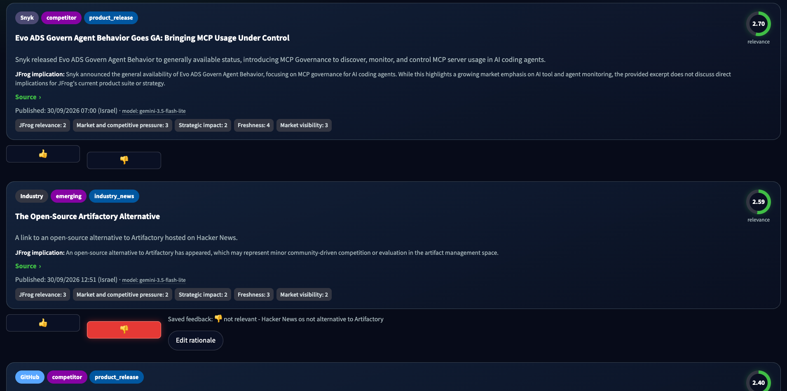
*News list: score ring, badges, summary, JFrog implication, source link, dimension scores, and 👍/👎 feedback.*

<p>
  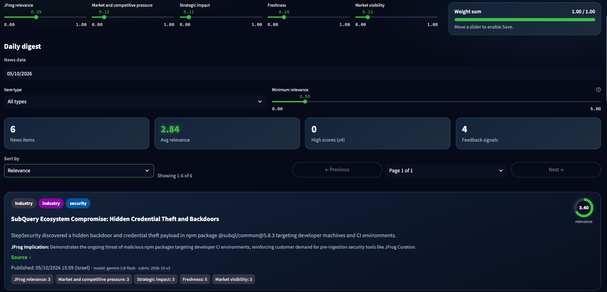
  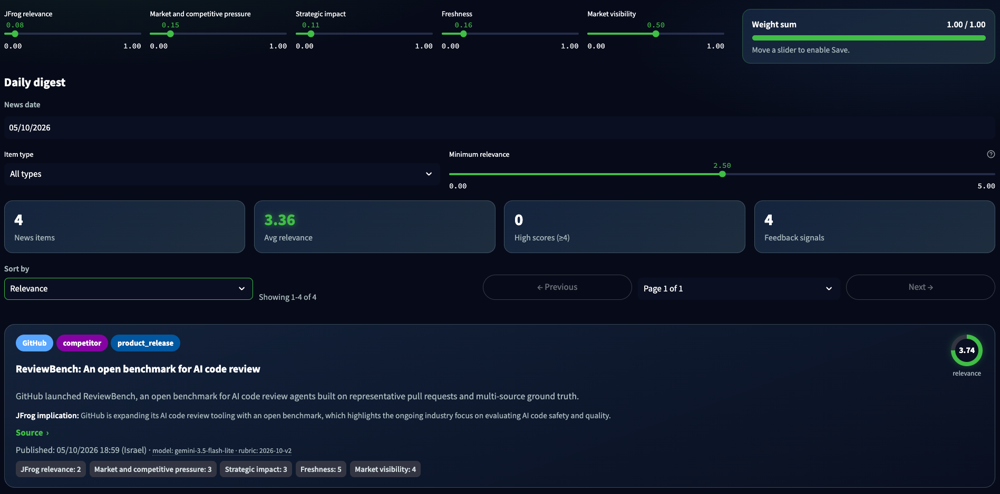
</p>

*Saving new weights (JFrog relevance 0.39 → 0.08, Market visibility 0.15 → 0.50, Freshness 0.20 → 0.16) re-ranks the list instantly, without calling the model again: the top item changes from “SubQuery Ecosystem Compromise: Hidden Credential Theft and Backdoors” to “ReviewBench: An open benchmark for AI code review”. The item count also drops because Minimum relevance was raised from 0.50 to 2.50 between the two shots.*

### Ask the Digest

Keyword retrieval over stored digest rows (top 6 by token overlap) plus the curated comparison matrix, then Gemini (`ask_model`).
The prompt instructs the model to answer **only** from retrieved news and matrix claims - a prompt rule, not a technical guarantee.
Follow-ups live in Streamlit session state only (lost on refresh / **New chat**), max **2** follow-ups per thread.

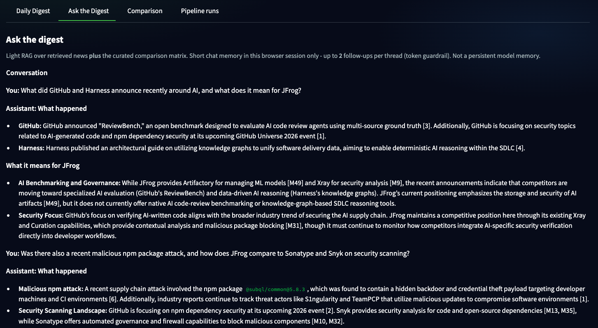
*Ask the Digest: a question and a follow-up, each answer is split into “What happened” and “What it means for JFrog”, citing news as [n] and comparison-matrix claims as [M#].*

### Comparison

Curated capability matrix from `config/comparison.yaml`. Every cell is a sourced claim (link + short quote) or **Unknown** - never generated from model memory. Analysts update the YAML when product pages change, the news pipeline does not rewrite it.

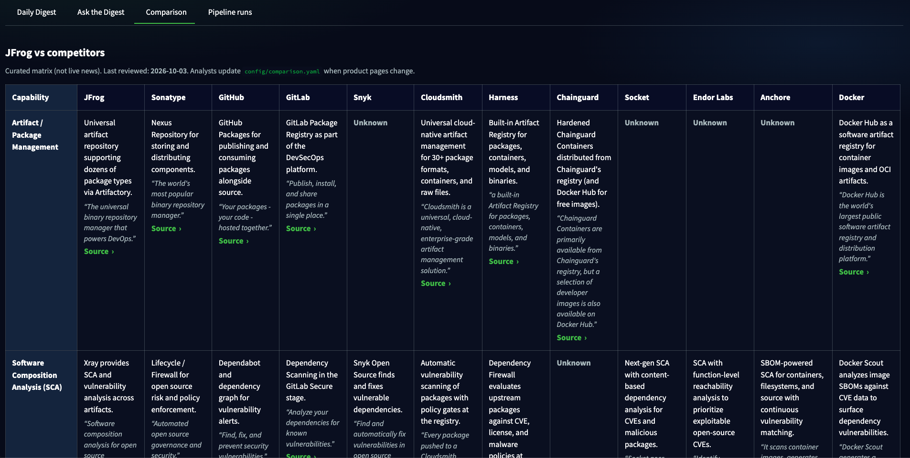
*Comparison matrix: each cell is a claim with a quote and source link, or Unknown.*

### Pipeline runs

History of cron, workflow_dispatch, and CLI runs (Israel timestamps), with per-source warnings for the selected run. Use this tab to confirm background ingestion after a scheduled or manual workflow.

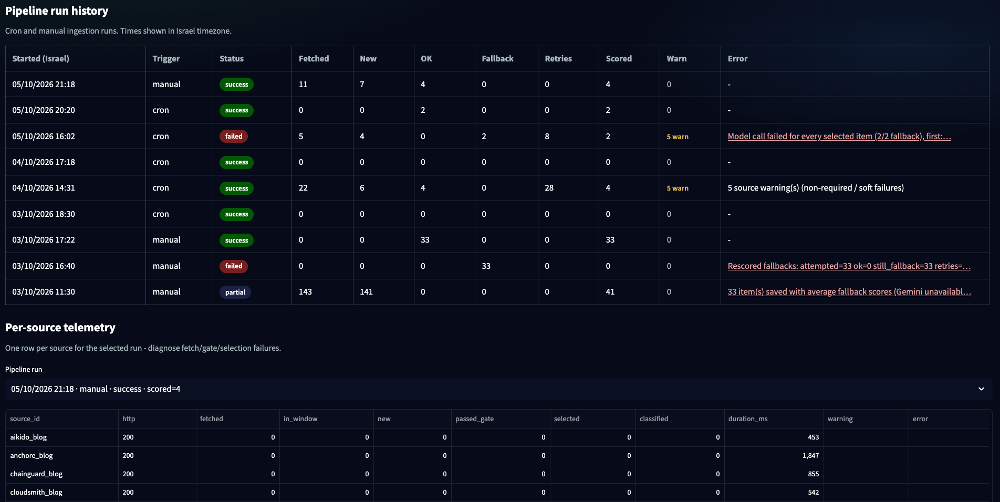
*Pipeline runs: status, counts and errors per run, plus per-source telemetry for the selected run.*

### Mobile

On narrow screens the layout stacks: news cards and feedback buttons go full width, and the comparison matrix and run history switch from tables to cards.

<p>
  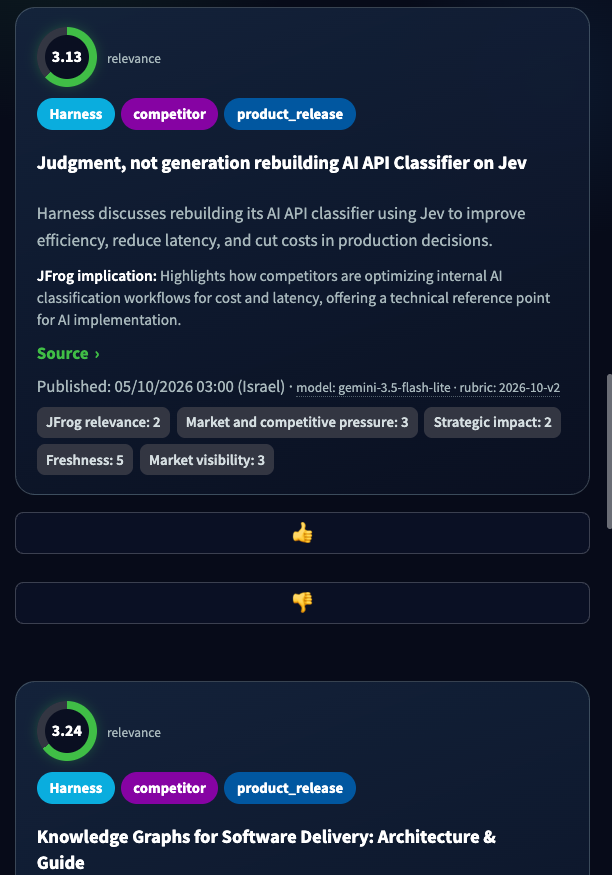
  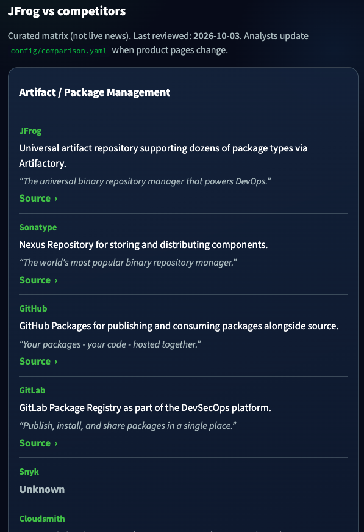
</p>

*Daily Digest cards (left) and the comparison matrix as cards (right) on a phone-sized screen.*

---

## Key design decisions

One-line summaries - full rationale in [DECISIONS.md](DECISIONS.md):

- **Gemini models in YAML** (`pipeline_model`, ordered `fallback_models`, `ask_model`) so model ids swap without code changes - [DECISIONS.md](DECISIONS.md#2026-10-02-model-ids-in-config-pipeline-fallback-ask)
- **Weights computed in code**, dimension scores stored, so sliders / Save weights need no LLM re-query - [DECISIONS.md](DECISIONS.md#2026-10-02-scoring-dimensions-and-default-weights)
- **Turso for shared demo DB**, local SQLite otherwise, Postgres noted as production choice - [DECISIONS.md](DECISIONS.md#2026-10-02-database-turso-for-shared-demo-postgres-for-real-production)
- **No seed database** - empty state points to the daily workflow / Pipeline runs, demo relies on live/cron data or Turso - [DECISIONS.md](DECISIONS.md#2026-10-03-removing-the-seed-database)
- **Dashboard does not run ingestion** - collection is scheduled/manual workflows or CLI only, the two buttons only dispatch those workflows - [DECISIONS.md](DECISIONS.md#2026-10-05-dashboard-does-not-run-ingestion)
- **Temporary open review demo** on Streamlit Community Cloud, deliberately without auth for the review only - [DECISIONS.md](DECISIONS.md#2026-10-08-temporary-open-review-demo)
- **48h freshness window** to survive date-only midnight stamps and one missed cron - [DECISIONS.md](DECISIONS.md#2026-10-03-48h-window-instead-of-24h)
- **Strict keyword gate** for industry/community, official/emerging pass through - [DECISIONS.md](DECISIONS.md#2026-10-03-per-source-relevance-gate-off-for-official-strict-for-industrycommunity)
- **Batched classify + per-model soft budgets** against Gemini free-tier PerDay limits - [DECISIONS.md](DECISIONS.md#2026-10-03-batched-classification-and-per-model-quota-budgeting)
- **`pending_scoring` + end-of-run heal + nightly retry** instead of silent mid-score fallbacks - [DECISIONS.md](DECISIONS.md#2026-10-03-self-healing-scoring-pending-state-automatic-rescore-nightly-retry)
- **Curated comparison YAML**, never LLM-authored product claims - [DECISIONS.md](DECISIONS.md#2026-10-02-comparison-matrix-as-curated-yaml-not-llm-generated)
- **Feedback table + UI now**, automated weight learning is Future Work - [DECISIONS.md](DECISIONS.md#2026-10-02-feedback-table-built-now-learning-engine-is-future-work)

**Presentation point:** operators can nudge ranking with weight sliders and record 👍/👎 plus a short rationale today. In the future, users will correct an item’s rating with a brief explanation, and a feedback loop that adjusts weights from user corrections (and potentially prompts) will take over. Storage and UI are built, the learning engine is not.

---

## Built now vs future work

### Built now

- Concurrent RSS/Atom ingestion from verified feeds (JFrog + core/secondary competitors + emerging vendors + research/industry/community)
- Freshness window, URL/title dedupe, relevance gate, kind-balanced selection
- Batched Gemini classification with structured dimensions, weighted total in code
- Soft per-model daily budgets, ordered fallback model chain, `pending_scoring`, end-of-run auto-rescore, nightly `retry_pending.yml`
- SQLite locally or optional shared Turso
- Streamlit UI: Daily Digest (filters, weights, feedback), Ask the Digest, Comparison, Pipeline runs (no ingest inside the UI)
- Live review demo on Streamlit Community Cloud with two buttons that dispatch the GitHub workflows
- Feedback table (item id, original score, 👍/👎, optional rationale, timestamp) + Save weights to DB
- GitHub Actions daily ingest (04:17 UTC) and pending rescore (10:37 UTC)
- Unit + offline pipeline integration tests

### Future work

- Analyst-approved update proposals for the comparison matrix (news-driven suggestions, human promote-to-YAML)
- Feedback-driven learning loop that adjusts weights (and potentially prompts) from 👍/👎 + rationales
- Evaluation set of hand-labeled items (classification / scoring quality)
- Better retrieval for Ask: BM25 first, then embeddings / vector DB as volume grows
- Non-RSS sources: financial reports, pricing pages, job postings, regulation (CISA/CRA) adapters
- Per-user weights and feedback, authentication, and managed Postgres
- Source health alerts and a monthly search for new candidate sources

---

## Challenges and pitfalls

| Pitfall | What we saw | Mitigation |
|---------|-------------|------------|
| Gemini free-tier **daily quota is per model** | `PerDay` errors stop generate, Ask / cron / CLI share the same key | Soft `llm_usage` + `model_daily_limits` per model id, **batched** classify (`batch_size: 5`), ordered `fallback_models` chain (each model once per run, blocked models skipped), remaining selected items → `pending_scoring`, end-of-run auto-rescore (`rescore_fallback_*`), nightly `retry_pending.yml` at 10:37 UTC, dashboard never starts ingest |
| **GitHub scheduled workflow delay** | Cron at 04:17 / 10:37 UTC often started **4-7 hours late** in practice (e.g. 06:00 schedule firing ~13:00 UTC) | Document as platform limitation, production would use a **dedicated scheduler** (e.g. Google Cloud Scheduler, AWS EventBridge, or a Kubernetes CronJob) with a small worker that triggers the same pipeline entrypoint |
| Feeds that block or fail | JFrog blog empty **HTTP 202**, IR/CISA **403**, hnrss.org **502/timeouts on every run** since 2026-10-03, The Register bot-challenge HTML | Browser UA only for `jfrog_blog`, disable with dated YAML notes, **all five `hn_*` feeds disabled 2026-10-05**, `required: false` soft-fail for community |
| Date-only timestamps | Midnight UTC stamps look “old” vs a morning run | **48h** `window_hours`, UI filter by ingest day (Asia/Jerusalem) |
| Archive-size feeds | `snyk.io/blog/feed/` ~1670 historical items | Parse/normalize **only in-window** entries before selection |
| Noisy community sources | `r/devops` was 25/25 filtered under strict gate | Disabled `reddit_devops`, keep HN keyword feeds with strict gate |
| Fallback / unscored looking “green” | Mid-score placeholders could look like real scores | UI shows **Not scored** for `is_fallback` / null scores, hide unscored by default |
| **Turso returns plain tuple rows**, tests used `sqlite3.Row` | A wrong column index raised `TypeError` before any Gemini call, every item became a fallback for two days, and graceful degradation hid it as a “model outage” | Fixed and covered by a tuple-row test, local programming errors now **fail the run** (`Internal error`, exit 1) instead of degrading |

---

## Security considerations

**In place**

- **Secrets:** `.env` locally (gitignored), GitHub Actions repository secrets (`GEMINI_API_KEY`, `TURSO_*`), and Streamlit Community Cloud secrets for the live demo (the same three plus `GITHUB_DISPATCH_TOKEN`, a fine-grained token limited to this repository and **Actions: Read and write**). `.env.example` has placeholders only. A scan of the full git history on 2026-10-05 found no real keys or tokens.
- **Redaction:** error text that is stored on pipeline runs or shown in the UI goes through `sanitize_error_text` (Gemini keys, bearer/JWT tokens, `api_key=` / `auth_token=` values). Uncaught exception messages stay in the server console (`client.showErrorDetails = false`).
- **SQL:** every query uses `?` parameters, Ask questions, feedback rationales and feed fields are never concatenated into SQL.
- **Output escaping:** HTML cards escape all dynamic text (`html.escape`). Links from feeds, the comparison matrix and Ask sources render only for `http`/`https`, links with other schemes in Ask conversation text are reduced to plain text.
- **Prompt injection:** feed text sits inside `<<<UNTRUSTED_CONTENT>>>` blocks (Ask: `<<<RETRIEVED_NEWS (UNTRUSTED DATA)>>>`) with an instruction to ignore embedded instructions, delimiter-like sequences in feed text are shortened so they cannot close the block.
- **Timeouts:** feed fetches 15 s, Gemini calls 60 s, workflow jobs 30 min.
- **Quota and cost:** at most 20 items per run, 5 per classify call, soft per-model daily limits, a persisted block after a hard daily-quota error, Ask questions capped at 2000 characters and 2 follow-ups, feedback rationale capped at 2000 characters.
- **Dashboard does not run ingestion:** collection runs only from the workflows or the CLI. The demo buttons only send a `workflow_dispatch`, lock for 3 minutes per session, and the shared concurrency group keeps at most one run active and one queued.
- **Workflows:** `permissions: contents: read`, actions pinned to major version tags, secrets passed only via `secrets.*` and never echoed.
- **Dependency scan** (`jf audit`, 2026-10-05): no High or Critical finding that contextual analysis marks applicable. Pillow 10.4.0 (pulled in by Streamlit 1.39.0, which requires `pillow<11`) has 1 Critical and 13 High CVEs, all marked Not Applicable, the fix needs Pillow 12.x and therefore a large Streamlit upgrade, deferred because the custom CSS is pinned to 1.39. Remaining Medium findings: Streamlit 1.39.0 (fixed in 1.53.1 / 1.54.0), Pillow, and pytest 8.3.3 (test-only, fixed in 9.0.3). python-dotenv was upgraded to 1.2.2 to fix CVE-2026-28684. The scan also flags the virtualenv's own `pip` / `setuptools`, run `pip install --upgrade pip setuptools` in your venv.

**Known limitations**

- The dashboard has no authentication. The live review demo is open on purpose and temporary, otherwise run it locally or behind SSO.
- The Turso token the dashboard uses can write (feedback and weights), so anyone who can reach a hosted dashboard can change shared data. In the open demo anyone can also start the two workflows, the per-session cooldown can be bypassed with a new session, and the concurrency group plus Gemini daily quotas bound the cost.
- Prompt-injection protection is best effort, not a sandbox.
- The Turso client uses libsql's default connection settings, the 30-minute job timeout is the backstop for a hung remote.

**Production next steps:** SSO in front of the dashboard, no public write access (no anonymous feedback, weights or workflow dispatch), separate least-privilege tokens per environment (read-only for viewers) with rotation, JFrog Xray / Curation scanning dependencies in CI.

---

## Known limitations

- **Gemini-only** today (`google-generativeai`), `provider:` in YAML is informational - multi-provider abstraction is not built.
- **Comparison matrix is manual** (`config/comparison.yaml`) and can go stale until an analyst updates it.
- **Ask** uses keyword retrieval and is instructed to answer only from retrieved context - by prompt instruction, not by technical guarantee.
- **Shared demo database** (Turso) means shared weights and feedback for anyone with the secrets, no per-user auth.
- **Same story from two sources with different titles** can appear twice (dedupe is URL + normalized title hash).

---

## Reference

### CLI flags

`python -m src.pipeline.run_daily` accepts:

| Flag | Purpose |
|------|---------|
| `--dry-run` | Fetch + dedupe + freshness + gate + select + print, no LLM, no DB writes |
| `--trigger manual\|cron` | Stored on `pipeline_runs` (default: `manual`) |
| `--limit N` | Selection/classify (or rescore) cap for this run, overrides `max_items_per_run` |
| `--backfill-days N` | Widen freshness window to N days for a real backfill ingest |
| `--rescore-fallbacks` | Re-classify `pending_scoring` / `is_fallback` items only (no feed fetch) |
| `--use-fallback-model` | Start on the first `fallback_models` entry from `config/model.yaml` (the rest of the chain still applies) |
| `--db PATH` | Force local SQLite path (skips Turso) |

Live process exit codes: **1** only when `status=failed`. `degraded` exits **0** (on GitHub Actions it also prints `::warning::Run degraded: …`).

### Config files

| File | What it controls |
|------|------------------|
| `config/competitors.yaml` | Tracked entities (JFrog, core/secondary/emerging), accent colors, enabled flags |
| `config/sources.yaml` | Feed URLs, kind, gate mode, required/enabled, UA, verification notes |
| `config/relevance.yaml` | Strict-gate strong keywords, maintenance title exclusions |
| `config/weights.yaml` | Default dimension weights (must sum to 1.0) and rubric descriptions |
| `config/model.yaml` | Gemini model ids, quotas, batch size, freshness window, selection caps, timeouts |
| `config/comparison.yaml` | Curated JFrog vs competitor capability matrix (sourced claims) |
| `config/demo.yaml` | GitHub repo, branch, workflow files and cooldown for the dashboard's pipeline buttons |
| `.streamlit/config.toml` | Streamlit dark theme tokens, hides exception details in the browser |
| `.env` / `.env.example` | `GEMINI_API_KEY`, optional Turso credentials, optional `GITHUB_DISPATCH_TOKEN`, optional `CI_INTEL_DB` |

### Project layout

```
config/                 YAML: competitors, sources, relevance, weights, model, comparison, demo
data/                   schema.sql, ci_intel.db created at runtime (gitignored)
docs/screenshots/       Screenshots used in this README
scripts/                verify_feeds.py, diagnose_fetch.py, backfill_report.py,
                        list_gemini_models.py, compare_models.py
src/config_loader.py    Load and validate YAML configs
src/app_secrets.py      Secret lookup: environment variables, then st.secrets
src/ingest/             RSS/Atom fetch + normalize
src/process/            dedupe, freshness, gate, selection, LLM classify/quota/rate-limit,
                        scoring, rescore, retry helpers
src/pipeline/           run_daily orchestrator (CLI entrypoint)
src/db/                 SQLite/Turso connection, migrate, models, repository
src/services/           digest, ask_digest, comparison, feedback, weights, github_dispatch
src/ui/                 Streamlit app, components, styles.css, assets/
tests/                  Unit tests + offline pipeline integration tests
.github/workflows/      daily_ingest.yml (04:17 UTC), retry_pending.yml (10:37 UTC)
DECISIONS.md            Architectural decision log
```

### Tests

```bash
pytest -q
```

Covers weighted scoring, dedupe, freshness, relevance gate, selection, config loading, schema migration, LLM parse/quota helpers, the fallback model chain, Ask retrieval, digest date filter, the GitHub dispatch buttons (mocked API: success, missing token, API error, cooldown), the `st.secrets` fallback, and more.

**Integration tests** (`tests/test_pipeline_integration.py`) run end-to-end with **no network and no live Gemini**: fixture RSS via a mocked HTTP client, mocked generate path, temporary SQLite. They cover happy-path statuses and caps, idempotent second run, daily quota → `pending_scoring`, rescore heal after quota, required vs community source failure, and `--dry-run` (no writes / no LLM).

---

## Stage 2 (DevOps)

Stage 2 (Xray scan, vulnerability write-up, Docker image to Artifactory, Build Info) lives in the fork: [https://github.com/morandeporto/jfrog_task](https://github.com/morandeporto/jfrog_task).
