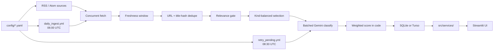

# CI Intel Tool

A working competitive-intelligence system for JFrog: daily RSS ingestion, Gemini classification, transparent relevance scoring, and a sourced comparison matrix against core competitors.
Built as a Stage 1 take-home for the GenAI & Competitive Intelligence Engineer role — real pipeline and UI, not a mockup.
Config-driven, cost-aware, and demoable with local SQLite or an optional shared Turso database.

> 📸 SCREENSHOT_TODO: docs/screenshots/01-daily-digest.png - Daily Digest, full page (hero)
<!--  -->

> 🎬 VIDEO_TODO: Add demo walkthrough URL here (e.g. Loom / unlisted YouTube)

<!--
SCREENSHOT / VIDEO REPLACEMENT STEPS:
1. Capture each PNG into docs/screenshots/ using the filename in the SCREENSHOT_TODO line.
2. Uncomment the HTML-commented image markdown line under that placeholder (remove <!-- and -->).
3. Delete the SCREENSHOT_TODO blockquote line above it.
4. For VIDEO_TODO: replace the placeholder line with a real markdown link, then delete the VIDEO_TODO marker.
-->

---

## Quick start

### Prerequisites

- Python **3.11+** (GitHub Actions uses 3.11)
- A [Gemini API key](https://aistudio.google.com/apikey) for live classification and Ask the Digest (not required for `--dry-run` or unit tests)
- Optional: [Turso](https://turso.tech/) database URL + auth token for a shared demo DB

### Setup

```bash
git clone https://github.com/morandeporto/ci-intel-tool.git
cd ci-intel-tool
python3 -m venv .venv
source .venv/bin/activate          # Windows: .venv\Scripts\activate
pip install -r requirements.txt
cp .env.example .env
```

Edit `.env` and set at least:

```
GEMINI_API_KEY=your-gemini-api-key-here
```

Leave `TURSO_DATABASE_URL` / `TURSO_AUTH_TOKEN` as placeholders (or blank) to use **local SQLite** at `data/ci_intel.db`. When both Turso vars are set to real values, the app and pipeline use the shared Turso database instead. Never commit `.env` (it is gitignored). See [`.env.example`](.env.example) for the full template.

### Run the UI

```bash
streamlit run src/ui/app.py
```

An empty database shows a friendly empty state with a **Run Now** button (there is no committed seed/fake DB).

### Run the pipeline

```bash
# Fetch + freshness + gate + select + print — no LLM calls, no DB writes
python -m src.pipeline.run_daily --dry-run

# Live ingest + classify (requires GEMINI_API_KEY)
python -m src.pipeline.run_daily
```

### Run tests

```bash
pytest -q
```

### How to access the UI

- **Local:** after `streamlit run src/ui/app.py`, open [http://localhost:8501](http://localhost:8501) (Streamlit’s default).
- **Hosted (optional):** `HOSTED_URL_TODO` — paste a Streamlit Community Cloud / other hosted URL here when available.

---

## How this answers the brief

| Brief requirement | Where this repo covers it |
|-------------------|---------------------------|
| Daily updates on industry / competitor news | Pipeline + GitHub Actions cron (`daily_ingest.yml` at 06:00 UTC); Daily Digest tab |
| JFrog vs competitors comparison | Comparison tab + curated `config/comparison.yaml` (every claim sourced or Unknown) |
| Real working solution (not a mockup) | Live RSS → classify → SQLite/Turso → Streamlit; **Run Now** and cron |
| Design / architecture / mechanism | [Architecture](#architecture), [Key design decisions](#key-design-decisions), [DECISIONS.md](DECISIONS.md) |
| A real UI | Streamlit app (`src/ui/app.py`) with four sections — see [UI tour](#ui-tour) |
| Built-now vs future split | [Built now vs future work](#built-now-vs-future-work) |
| Challenges and pitfalls | [Challenges and pitfalls](#challenges-and-pitfalls) |

---

## Architecture



**Config → sources.** Tracked vendors and feed URLs live in `config/competitors.yaml` and `config/sources.yaml` (enabled flags, kind, gate mode, `required`). No mock URLs — feeds are verified or disabled with dated notes.

**Fetch.** Concurrent HTTP fetch (`fetch_concurrency`, `fetch_timeout_seconds` in `config/model.yaml`). Default identifiable User-Agent; only `jfrog_blog` uses a browser UA when the honest UA gets empty HTTP 202 responses.

**Freshness window.** Keep items with `published_at` inside `window_hours` (default **48**). Future-dated items are dropped; missing dates are logged. `--backfill-days N` widens the window for a real backfill.

**Dedupe.** Skip items already stored by **URL** or by **normalized title hash** (`src/process/dedupe.py`). Same story under two different titles can still appear twice.

**Relevance gate.** Per-source `gate: off` (official/emerging) or `gate: strict` (industry/community) using `config/relevance.yaml` strong keywords. Maintenance title patterns are excluded for all sources.

**Selection.** Cap via `max_items_per_run` (20) and `max_per_source` (3), with reserved slots by kind (`selection.reserved_slots` in `config/model.yaml`). Cap-skipped items are not stored. UI **Run Now** uses `ui_run_now_limit` (10).

**Batched classification.** Gemini structured JSON in batches of `batch_size` (5). Soft per-model budgets in `model_daily_limits`; hard stop is Google’s free-tier PerDay error. Mid-run quota leaves remaining selected items as `pending_scoring`; pipeline may switch once to `fallback_model`.

**Weighted score in code.** LLM returns dimension scores 1–5; `src/process/scoring.py` applies weights from `config/weights.yaml` (or DB overrides). Retuning weights needs no new LLM calls.

**Database.** Local `data/ci_intel.db` or Turso when configured. Schema in `data/schema.sql`; migrations in `src/db/migrate.py`.

**Services → UI.** `src/services/` (digest, ask, comparison, feedback, weights) stays separate from Streamlit so a future read-only MCP layer can wrap the same functions.

**GitHub Actions.** `daily_ingest.yml` (06:00 UTC + manual) runs `--trigger cron` against Turso. `retry_pending.yml` (08:30 UTC) runs `--rescore-fallbacks`. Both share concurrency group `ci-intel-pipeline`.

---

## UI tour

The Streamlit app emulates a JFrog-like dark aesthetic (navy `#070B19`, green `#40BE46`, Open Sans via theme/CSS). It is **not** an official JFrog component library. Streamlit is pinned at `streamlit==1.39.0` because custom tab/button CSS is fragile across releases.

Navigation uses a horizontal radio (not `st.tabs`) so Ask follow-ups and Run Now stay on the active section after rerun.

### Daily Digest

Sorted news cards with filters, weight sliders, feedback, and **Run Now**.
The **News date** filter uses the calendar day the system **ingested** the item (`ingested_at` → Asia/Jerusalem); cards still show the article’s **published** date (Israel local). Default is Israel “today”, or the latest day that has items.
**Minimum relevance** (default 2.5) hides lower scored items; **Show unscored** reveals `pending_scoring` / fallback rows (shown as “Not scored”). Weight sliders re-rank from stored dimensions without new LLM calls; **Save weights** persists shared overrides to the DB.

> 📸 SCREENSHOT_TODO: docs/screenshots/01-daily-digest.png - Daily Digest, full page
<!--  -->

> 📸 SCREENSHOT_TODO: docs/screenshots/02-weights-before.png - Weight sliders before re-ranking
<!--  -->

> 📸 SCREENSHOT_TODO: docs/screenshots/03-weights-after.png - Digest re-ranked after moving a slider
<!--  -->

> 📸 SCREENSHOT_TODO: docs/screenshots/04-feedback.png - Thumbs feedback with optional rationale
<!--  -->

### Ask the Digest

Keyword retrieval over stored digest rows (top 6 by token overlap) plus the curated comparison matrix, then Gemini (`ask_model`).
The prompt instructs the model to answer **only** from retrieved news and matrix claims — a prompt rule, not a technical guarantee.
Follow-ups live in Streamlit session state only (lost on refresh / **New chat**), max **2** follow-ups per thread.

> 📸 SCREENSHOT_TODO: docs/screenshots/05-ask-the-digest.png - Ask the Digest conversation
<!--  -->

### Comparison

Curated capability matrix from `config/comparison.yaml`. Every cell is a sourced claim (link + short quote) or **Unknown** — never generated from model memory. Analysts update the YAML when product pages change; the news pipeline does not rewrite it.

> 📸 SCREENSHOT_TODO: docs/screenshots/06-comparison.png - Comparison matrix
<!--  -->

### Pipeline runs

History of cron and manual runs (Israel timestamps), with per-source warnings for the selected run. Useful to show automated background execution next to **Run Now**.

> 📸 SCREENSHOT_TODO: docs/screenshots/07-pipeline-runs.png - Pipeline run history
<!--  -->

> 📸 SCREENSHOT_TODO: docs/screenshots/08-github-actions.png - GitHub Actions workflow runs
<!--  -->

> 📸 SCREENSHOT_TODO: docs/screenshots/09-mobile.png - Optional mobile / narrow layout
<!--  -->

---

## Key design decisions

One-line summaries — full rationale in [DECISIONS.md](DECISIONS.md):

- **Gemini models in YAML** (`pipeline_model`, `fallback_model`, `ask_model`) so model ids swap without code changes — [DECISIONS.md](DECISIONS.md#2026-10-02-model-ids-in-config-pipeline-fallback-ask)
- **Weights computed in code**, dimension scores stored, so sliders / Save weights need no LLM re-query — [DECISIONS.md](DECISIONS.md#2026-10-02-scoring-dimensions-and-default-weights)
- **Turso for shared demo DB**, local SQLite otherwise; Postgres noted as production choice — [DECISIONS.md](DECISIONS.md#2026-10-02-database-turso-for-shared-demo-postgres-for-real-production)
- **No seed database** — empty state + Run Now; demo relies on live/cron data or Turso — [DECISIONS.md](DECISIONS.md#2026-10-03-removing-the-seed-database)
- **48h freshness window** to survive date-only midnight stamps and one missed cron — [DECISIONS.md](DECISIONS.md#2026-10-03-48h-window-instead-of-24h)
- **Strict keyword gate** for industry/community; official/emerging pass through — [DECISIONS.md](DECISIONS.md#2026-10-03-per-source-relevance-gate-off-for-official-strict-for-industrycommunity)
- **Batched classify + per-model soft budgets** against Gemini free-tier PerDay limits — [DECISIONS.md](DECISIONS.md#2026-10-03-batched-classification-and-per-model-quota-budgeting)
- **`pending_scoring` + end-of-run heal + nightly retry** instead of silent mid-score fallbacks — [DECISIONS.md](DECISIONS.md#2026-10-03-self-healing-scoring-pending-state-automatic-rescore-nightly-retry)
- **Curated comparison YAML**, never LLM-authored product claims — [DECISIONS.md](DECISIONS.md#2026-10-02-comparison-matrix-as-curated-yaml-not-llm-generated)
- **Feedback table + UI now**; automated weight learning is Future Work — [DECISIONS.md](DECISIONS.md#2026-10-02-feedback-table-built-now-learning-engine-is-future-work)

**Presentation point:** operators can nudge ranking with weight sliders and record 👍/👎 plus a short rationale today. In the future, users will correct an item’s rating with a brief explanation, and an automated feedback loop will adjust weights (and potentially prompts) — the same idea as a lead-scoring feedback loop. Storage and UI are built; the learning engine is not.

---

## Built now vs future work

### Built now

- Concurrent RSS/Atom ingestion from verified feeds (JFrog + core/secondary competitors + emerging vendors + research/industry/community)
- Freshness window, URL/title dedupe, relevance gate, kind-balanced selection
- Batched Gemini classification with structured dimensions; weighted total in code
- Soft per-model daily budgets, fallback model switch, `pending_scoring`, end-of-run auto-rescore, nightly `retry_pending.yml`
- SQLite locally or optional shared Turso
- Streamlit UI: Daily Digest (filters, weights, feedback, Run Now), Ask the Digest, Comparison, Pipeline runs
- Feedback table (item id, original score, 👍/👎, optional rationale, timestamp) + Save weights to DB
- GitHub Actions daily ingest (06:00 UTC) and pending rescore (08:30 UTC)
- Unit + offline pipeline integration tests

### Future work

- Analyst-approved update proposals for the comparison matrix (news-driven suggestions, human promote-to-YAML)
- Feedback-driven learning loop that adjusts weights (and potentially prompts) from 👍/👎 + rationales
- Evaluation set of hand-labeled items (classification / scoring quality)
- Better retrieval for Ask: BM25 first, then embeddings / vector DB as volume grows
- Non-RSS sources: financial reports, pricing pages, job postings, regulation (CISA/CRA) adapters
- Per-user weights and feedback, authentication, and managed Postgres
- Source health alerts and a monthly search for new candidate sources

---

## Challenges and pitfalls

| Pitfall | What we saw | Mitigation |
|---------|-------------|------------|
| Gemini free-tier **daily quota is per model** | `PerDay` errors stop generate; Ask / Run Now / cron share the same key | Soft `llm_usage` + `model_daily_limits` per model id; **batched** classify (`batch_size: 5`); optional `fallback_model` switch once; remaining selected items → `pending_scoring`; end-of-run auto-rescore (`rescore_fallback_*`); nightly `retry_pending.yml` at 08:30 UTC |
| Feeds that block or fail | JFrog blog empty **HTTP 202**; IR/CISA **403**; hnrss.org intermittent **502**; The Register bot-challenge HTML | Browser UA only for `jfrog_blog`; disable with dated YAML notes; 5xx retry+backoff for `hn_*`; `required: false` soft-fail for community |
| Date-only timestamps | Midnight UTC stamps look “old” vs a morning run | **48h** `window_hours`; UI filter by ingest day (Asia/Jerusalem) |
| Archive-size feeds | `snyk.io/blog/feed/` ~1670 historical items | Parse/normalize **only in-window** entries before selection |
| Noisy community sources | `r/devops` was 25/25 filtered under strict gate | Disabled `reddit_devops`; keep HN keyword feeds with strict gate |
| Fallback / unscored looking “green” | Mid-score placeholders could look like real scores | UI shows **Not scored** for `is_fallback` / null scores; hide unscored by default |

---

## Security considerations

- Secrets stay in `.env` locally and in GitHub Actions repository secrets (`GEMINI_API_KEY`, `TURSO_*`); `.env.example` ships placeholders; `.gitignore` blocks `.env`.
- Untrusted article/RSS text is placed inside `<<<UNTRUSTED_CONTENT>>>` … `<<<END_UNTRUSTED_CONTENT>>>` delimiters with an instruction to ignore embedded instructions — **best-effort** prompt hygiene, not a sandbox guarantee.
- Dynamic fields rendered in the UI are HTML-escaped (`html.escape` in `src/ui/components.py`).
- Cost guardrails: `max_items_per_run`, `ui_run_now_limit`, soft `model_daily_limits`, request timeouts, excerpt length, rate-limit intervals, Ask follow-up cap.
- In production, dependency scanning and package policy would use **JFrog Xray / Curation**.

---

## Known limitations

- **Gemini-only** today (`google-generativeai`); `provider:` in YAML is informational — multi-provider abstraction is not built.
- **Comparison matrix is manual** (`config/comparison.yaml`) and can go stale until an analyst updates it.
- **Ask** uses keyword retrieval and is instructed to answer only from retrieved context — by prompt instruction, not by technical guarantee.
- **Shared demo database** (Turso) means shared weights and feedback for anyone with the secrets; no per-user auth.
- **Same story from two sources with different titles** can appear twice (dedupe is URL + normalized title hash).

---

## Reference

### CLI flags

`python -m src.pipeline.run_daily` accepts:

| Flag | Purpose |
|------|---------|
| `--dry-run` | Fetch + dedupe + freshness + gate + select + print; no LLM, no DB writes |
| `--trigger manual\|cron` | Stored on `pipeline_runs` (default: `manual`) |
| `--limit N` | Selection/classify (or rescore) cap for this run; overrides `max_items_per_run` |
| `--backfill-days N` | Widen freshness window to N days for a real backfill ingest |
| `--rescore-fallbacks` | Re-classify `pending_scoring` / `is_fallback` items only (no feed fetch) |
| `--use-fallback-model` | Run the whole job on `fallback_model` from `config/model.yaml` |
| `--db PATH` | Force local SQLite path (skips Turso) |

Live process exit codes: **1** only when `status=failed`. `degraded` exits **0** (on GitHub Actions it also prints `::warning::Run degraded: …`).

### Config files

| File | What it controls |
|------|------------------|
| `config/competitors.yaml` | Tracked entities (JFrog, core/secondary/emerging), accent colors, enabled flags |
| `config/sources.yaml` | Feed URLs, kind, gate mode, required/enabled, UA, verification notes |
| `config/relevance.yaml` | Strict-gate strong keywords; maintenance title exclusions |
| `config/weights.yaml` | Default dimension weights (must sum to 1.0) and rubric descriptions |
| `config/model.yaml` | Gemini model ids, quotas, batch size, freshness window, selection caps, timeouts |
| `config/comparison.yaml` | Curated JFrog vs competitor capability matrix (sourced claims) |
| `.streamlit/config.toml` | Streamlit dark theme tokens |
| `.env` / `.env.example` | `GEMINI_API_KEY`, optional Turso credentials, optional `CI_INTEL_DB` |

### Project layout

```
config/                 YAML: competitors, sources, relevance, weights, model, comparison
data/                   schema.sql; ci_intel.db created at runtime (gitignored)
docs/screenshots/       UI screenshot placeholders for the README
scripts/                verify_feeds.py, diagnose_fetch.py, backfill_report.py,
                        list_gemini_models.py, compare_models.py
src/config_loader.py    Load and validate YAML configs
src/ingest/             RSS/Atom fetch + normalize
src/process/            dedupe, freshness, gate, selection, LLM classify/quota/rate-limit,
                        scoring, rescore, retry helpers
src/pipeline/           run_daily orchestrator (CLI entrypoint)
src/db/                 SQLite/Turso connection, migrate, models, repository
src/services/           digest, ask_digest, comparison, feedback, weights
src/ui/                 Streamlit app, components, styles.css, assets/
tests/                  Unit tests + offline pipeline integration tests
.github/workflows/      daily_ingest.yml (06:00 UTC), retry_pending.yml (08:30 UTC)
DECISIONS.md            Architectural decision log
PRESENTATION_PREP.md    Panel presentation script and Q&A
```

### Tests

```bash
pytest -q
```

Covers weighted scoring, dedupe, freshness, relevance gate, selection, config loading, schema migration, LLM parse/quota helpers, Ask retrieval, digest date filter, and more.

**Integration tests** (`tests/test_pipeline_integration.py`) run end-to-end with **no network and no live Gemini**: fixture RSS via a mocked HTTP client, mocked generate path, temporary SQLite. They cover happy-path statuses and caps, idempotent second run, daily quota → `pending_scoring`, rescore heal after quota, required vs community source failure, and `--dry-run` (no writes / no LLM).

---

## Stage 2 (DevOps)

`STAGE2_FORK_TODO` — link to the Stage 2 fork of `jfrog_task` (Xray scan, vulnerability write-up, Docker → Artifactory, Build Info) will go here.
